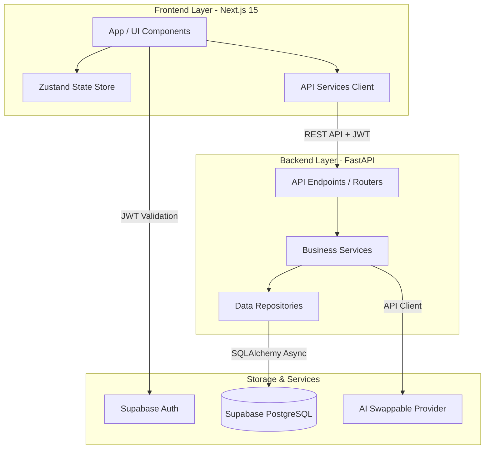
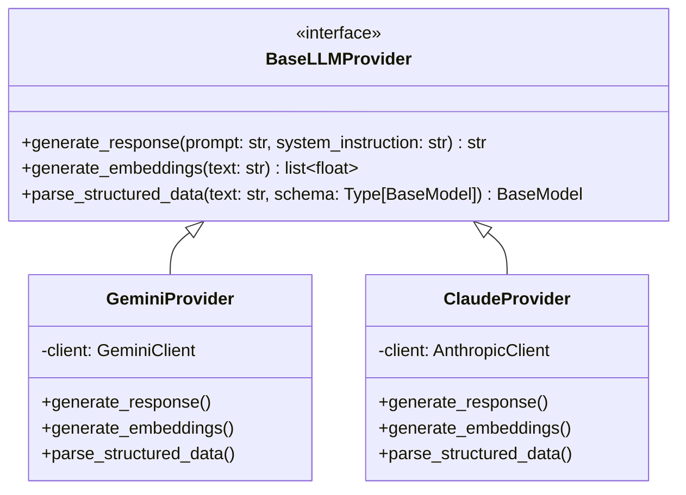

# Master Plan - Offerly Career Copilot

This document serves as the **Single Source of Truth** for the development of **Offerly**, an enterprise-grade, AI-powered Career Copilot designed to assist job seekers in discovering opportunities, optimizing resumes, tracking applications, and preparing for interviews.

---

## 1. Vision & Mission

### Vision
To redefine the job search experience by transforming it from a fragmented, manual chore into an intelligent, data-driven journey. Offerly empowers professionals to navigate their career paths with certainty, leveraging artificial intelligence to eliminate information asymmetry and highlight hidden opportunities.

### Mission
To build a highly scalable, secure, and production-quality SaaS platform that provides job seekers with automated, ATS-optimized resume engineering, deep semantic job matching, centralized application tracking, and actionable career insights.

---

## 2. Product Goals
- **Empower Job Seekers**: Deliver automated, context-aware resume tailoring that reduces manual matching time from hours to seconds.
- **Provide Actionable Intelligence**: Score matches using robust semantic analysis of resume skills, experiences, and target job descriptions.
- **Ensure Enterprise-Scale Reliability**: Establish a solid technical architecture capable of high-throughput document processing and low-latency API responses.
- **Promote Data Integrity & Security**: Protect user privacy and proprietary resume data using secure, modern authentication patterns and granular database access rules.

---

## 3. Project Scope
Offerly focuses on three core product pillars:
1. **Intelligent Profile & Resume Engineering**: Parsing user CVs, analyzing deficiencies relative to job markets, and compiling tailored resumes in multiple formats (PDF, Markdown, JSON).
2. **Semantic Job Board & Matching Engine**: Aggregating opportunities and running multi-criteria similarity computations to score compatibility (skills, location, level, salary).
3. **Application Lifecycle Tracker**: A kanban-style management system tracking applications from discovery to offer, backed by automated notification and tracking workflows.

*Excluded from Phase 1 scope:* Paid payroll components, interview scheduling integrations, video parsing pipelines, and direct job application submission bots (auto-apply).

---

## 4. Technology Stack

### Frontend
- **Framework**: Next.js 15 (App Router for optimized routing and layout management)
- **Library**: React 19 (Server Components for rapid page loading)
- **Language**: TypeScript (Type safety and interface contract definition)
- **Styling**: Tailwind CSS (Utility-first styling with custom global color schemes)
- **UI & Accessibility**: shadcn/ui & Radix UI (Unstyled, accessible primitives)
- **Animations**: Framer Motion (Smooth page transitions, micro-animations, interactive states)
- **Icons**: Lucide React (Clean vector iconography)

### Backend
- **Framework**: FastAPI (Asynchronous Python framework with built-in Pydantic integration)
- **Runtime**: Python 3.12+ (Optimized performance and robust scientific/AI library ecosystem)
- **ORM**: SQLAlchemy 2.0 (Declarative mapping and async session management)
- **Migrations**: Alembic (Database schema change tracking)
- **Validation**: Pydantic v2 (Input/output validation and environment parsing)
- **Server**: Uvicorn (ASGI server implementation)

### Database & Authentication
- **Database**: Supabase PostgreSQL (Relational transactional database with Row-Level Security)
- **Authentication**: Supabase Auth (OAuth 2.0, JWT, and multi-factor validation support)

### AI Engines
- **Primary LLM**: Google Gemini API (High-performance text generation and embedding processing)
- **Secondary LLM**: Anthropic Claude API (Advanced semantic parsing, logical structure editing, and ATS scoring)

---

## 5. Folder Structure
The codebase is structured to enforce separation of concerns, scalability, and Domain-Driven Design (DDD) principles.

```
Offerly/
├── .github/                     # CI/CD pipelines
├── assets/                      # Direct static assets
├── backend/                     # Python Clean Architecture backend
│   ├── app/                     # Source application
│   │   ├── ai/                  # Swappable AI Engine modules & provider adapters
│   │   ├── api/                 # Endpoint routers (Presentation)
│   │   ├── core/                # System core configurations (logging, security)
│   │   ├── config/              # App settings & validations (Pydantic Settings)
│   │   ├── database/            # DB connection lifecycle & session factories
│   │   ├── middleware/          # CORS, rate limit intercepts
│   │   ├── models/              # SQLAlchemy entities (ORM representation)
│   │   ├── repositories/        # SQL data logic (Repository Pattern)
│   │   ├── schemas/             # Pydantic validation structures
│   │   ├── services/            # Pure Business logic domain rules
│   │   └── utils/               # App-wide utility helpers
│   └── tests/                   # Pytest suites
├── database/                    # Raw database management definitions
├── design/                      # UI mockups, icons, wireframes
├── docs/                        # Project technical documentation (The Brain)
├── frontend/                    # Next.js 15 TypeScript project
│   ├── app/                     # Next.js App Router root layout and pages
│   ├── components/              # Shared global UI primitives
│   ├── config/                  # Client variables & endpoint references
│   ├── constants/               # Key values, menus, page routes
│   ├── features/                # Domain-specific feature modules (auth, jobs, resume)
│   ├── hooks/                   # App-wide React hooks
│   ├── providers/               # Global React context provider wraps
│   ├── public/                  # Public static assets
│   ├── services/                # API client definitions
│   ├── store/                   # Global client state (Zustand)
│   ├── styles/                  # Tailwind configurations & globals
│   ├── types/                   # Shared TypeScript interfaces
│   └── utils/                   # Shared frontend helper utilities
├── infrastructure/              # Devops, docker, local Supabase setups
├── project-management/          # Agile process sprint sheets
├── prompts/                     # Prompt templates repository (Gemini/Claude)
├── scripts/                     # Local setup & data seed pipelines
├── .env.example                 # Environment variable template
├── docker-compose.yml           # Local multi-container development configuration
├── LICENSE                      # Open/internal licensing guidelines
└── README.md                    # Quickstart guide & developer onboarding info
```

---

## 6. System Architecture Overview



### Core Architecture Characteristics
1. **Unidirectional Dependency Flow**: The presentation layer (`api/`) knows about business logic (`services/`), which knows about repositories (`repositories/`). The core data models (`models/`) are agnostic.
2. **Framework Independence**: The database and external API adapters are fully decoupled using interface injection.
3. **Optimized Client-Server Boundary**: Next.js Server Components load static elements immediately; highly interactive components execute on the client, contacting FastAPI asynchronously via JSON requests.

---

## 7. AI Architecture

Offerly uses an abstraction pattern to decouple the application from specific AI vendor SDKs.



- **`providers/`**: Holds the virtual interfaces outlining standard methods (completions, parsing, vectors).
- **`gemini/` and `claude/`**: Adapter classes implementing vendor APIs. High-token tasks (like document structural analysis) route to Gemini, whereas complex ATS matching tasks route to Claude.
- **`prompts/`**: Externalized template engines loaded dynamic variables at runtime.
- **`matching/`**: Standardizes comparison logic, applying cosine-similarity functions over text embeddings to compute compatibility metrics.

---

## 8. Database Overview (Supabase PostgreSQL)

Offerly implements a PostgreSQL relational layout. Row-Level Security (RLS) is applied to all tables to isolate user data.

### Core Tables
1. **`users`**: Extended profile configurations referencing Supabase Auth `uuid`.
2. **`resumes`**: Stores JSON representations of resume sections (work history, skills, education) alongside generated PDFs.
3. **`companies`**: Details on job-offering corporations.
4. **`jobs`**: Target job listings containing scraped details, descriptions, and tag arrays.
5. **`applications`**: Tracks the progression of a user's target job applications through columns like state, interview dates, and match ratings.

---

## 9. Core Implementation Strategies

### Authentication Strategy
- **Supabase Auth** acts as the Identity Provider.
- Authentication tokens (JWTs) are obtained on the frontend client and forwarded in the `Authorization: Bearer <token>` header of all requests.
- FastAPI utilizes a JWT verification middleware that checks the signature using Supabase's public keys and injects a `current_user` object into endpoint parameters via FastAPI dependencies.

### Resume Generation Strategy
- User provides raw inputs or uploads a document.
- The AI parsing service extracts structural details into a defined JSON Schema.
- Users can choose to customize their CV for a specific target job. The backend updates bullet points to align with job keywords, generating a tailored JSON structure.
- The tailored JSON is transformed into markdown and compiled into a PDF document on the backend using headless rendering utilities.

### Job Matching Strategy
- High-dimension embeddings are generated for both the job description and user resume elements using Google's text-embedding models.
- A cosine-similarity calculation determines a baseline score.
- The system checks for hard constraints (e.g., location compatibility, visa sponsorship status, and critical tools/skills).
- The matching service combines semantic scores with keyword match percentages to generate an overall compatibility rating.

---

## 10. Deployment Strategy
- **Frontend**: Deployed to Vercel for optimal CDN distribution and Next.js feature support.
- **Backend**: Containerized via Docker and deployed to AWS ECS / GCP Cloud Run using automated GitHub Actions CI/CD pipelines.
- **Database**: Hosted on Supabase (managed AWS instances) with daily automated backups.
- **Environments**: Strict split between `development`, `staging`, and `production`.

---

## 11. Sprint Roadmap

```
  Sprint 0: Scaffolding & System Docs (Current)
  └── Setup project folders, standards, configuration files, and documentation layers.
  
  Sprint 1: Core Framework & User Profiles
  └── Setup DB schemas, auth middleware, user models, and basic frontend registration layouts.
  
  Sprint 2: Resume Parser & Storage
  └── Implement document ingestion, JSON Schema parsers, and AWS S3/Supabase Storage integrations.
  
  Sprint 3: AI Provider Adapters & Prompt Loading
  └── Integrate Gemini/Claude adapters and implement dynamic prompt compilation utilities.
  
  Sprint 4: Resume Optimization Engine
  └── Implement ATS-aligned resume tailoring services and backend PDF rendering systems.
  
  Sprint 5: Job Boards & Search Aggregators
  └── Set up job posting tables, scraping webhooks, and search/filtering API endpoints.
  
  Sprint 6: Semantic Matching Engine
  └── Set up vector processing jobs, cosine similarity metrics, and match breakdown dashboards.
  
  Sprint 7: Kanban Application Tracker
  └── Build interactive dashboards, status change pipelines, and analytic charts.
  
  Sprint 8: Monitoring, Polishing & Security
  └── Set up logging monitoring dashboards, rate limit rules, CORS setup, and security audits.
```

---

## 12. Future Features (Post-Phase 1)
- **Offerly Auto-Apply Engine**: Secure, AI-driven form completion workflows.
- **AI Interview Coach**: Real-time voice/chat interviews mock simulations.
- **Career Path Predictive Modeling**: Recommending skill acquisition plans based on job market trends.
