# Technical Blueprint - Offerly

This document defines the technical architecture, data structures, communication protocols, security profiles, and execution models for **Offerly**, a production-quality AI Career Copilot. It serves as the primary system specification reference for developers.

---

## 1. High-Level System Architecture

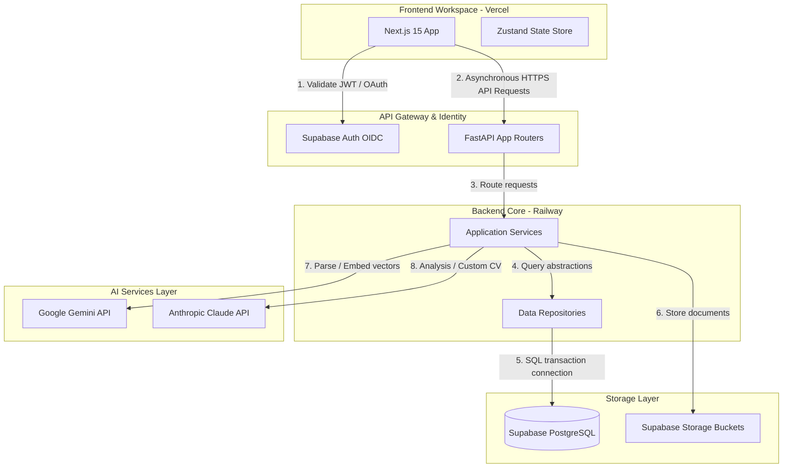

### System Interfaces & Communications
- **Client to Gateway**: The Next.js frontend interacts with the FastAPI backend asynchronously using JSON-serialized REST APIs.
- **Gateway to Authentication**: Client requests include a JWT token. The FastAPI backend decodes and validates this token locally using Supabase's public keys.
- **Backend Core to Database**: Repositories interact with PostgreSQL through async SQLAlchemy session connections.
- **Backend Core to AI Engine**: Interacts with Gemini and Claude API gateways using asynchronous, TLS-encrypted HTTP clients.

---

## 2. Authentication Architecture

Offerly delegates credential storage, password hashing, verification timers, and OAuth integrations to **Supabase Auth**.

### Session Lifecycle

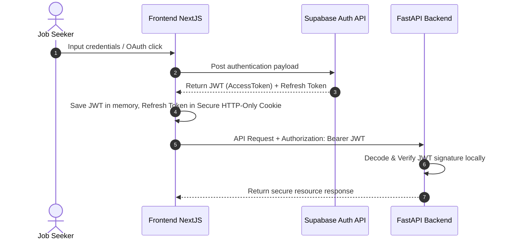

### Key Security Policies & Flows
- **Refresh Token Cycle**: The client-side SDK handles token refresh automatically in the background using the secure, HTTP-only refresh cookie.
- **Protected Routes**: Custom route dependencies (`Depends(get_current_user)`) block requests that lack a valid signature.
- **Role Management**: Roles (`candidate`, `admin`) are stored in the public `users` table and linked directly to Supabase Auth's `auth.users.id`.
- **Logout Flow**: The logout endpoint invalidates local session memory and revokes refresh tokens on the Supabase authentication server.

---

## 3. Database Architecture (Supabase PostgreSQL)

Offerly implements a relational database structure. Row-Level Security (RLS) policies are active across all user-associated tables.

### Table Definitions

#### `users`
- **Purpose**: Extends default Supabase Auth details with application-specific preferences.
- **Columns**:
  - `id`: `UUID` (Primary Key, foreign key referencing `auth.users.id` with `ON DELETE CASCADE`).
  - `email`: `VARCHAR(255)` (Unique, Not Null).
  - `target_role`: `VARCHAR(100)` (Nullable).
  - `experience_level`: `VARCHAR(50)` (Nullable, constraint: `IN ('entry', 'mid', 'senior', 'lead')`).
  - `target_salary_min`: `NUMERIC(12, 2)` (Nullable).
  - `target_salary_max`: `NUMERIC(12, 2)` (Nullable).
  - `created_at`: `TIMESTAMPTZ` (Default: `now()`).
  - `updated_at`: `TIMESTAMPTZ` (Default: `now()`).
- **Indexes**: Unique index on `email`.

#### `resumes`
- **Purpose**: Stores CV structures and optimized resume versions.
- **Columns**:
  - `id`: `UUID` (Primary Key, default: `gen_random_uuid()`).
  - `user_id`: `UUID` (Foreign key referencing `users.id` with `ON DELETE CASCADE`, Not Null).
  - `version_name`: `VARCHAR(100)` (Not Null, default: `'Original'`).
  - `raw_text`: `TEXT` (Not Null).
  - `structured_data`: `JSONB` (Not Null, validating schema properties: work history, education, skills).
  - `file_path`: `VARCHAR(512)` (Not Null, points to file location in storage bucket).
  - `ats_score`: `INT` (Nullable).
  - `is_primary`: `BOOLEAN` (Default: `false`).
  - `created_at`: `TIMESTAMPTZ` (Default: `now()`).
- **Indexes**: Index on `user_id`, GIN index on `structured_data`.
- **Constraints**: One primary resume allowed per user (enforced via partial index).

#### `companies`
- **Purpose**: Centralized corporate registry.
- **Columns**:
  - `id`: `UUID` (Primary Key, default: `gen_random_uuid()`).
  - `name`: `VARCHAR(150)` (Not Null, Unique).
  - `domain`: `VARCHAR(100)` (Unique, Nullable).
  - `logo_url`: `VARCHAR(512)` (Nullable).
  - `description`: `TEXT` (Nullable).
  - `industries`: `VARCHAR(100)[]` (Default: `{}`).
- **Indexes**: Unique index on `name`.

#### `jobs`
- **Purpose**: Centralized job listings directory.
- **Columns**:
  - `id`: `UUID` (Primary Key, default: `gen_random_uuid()`).
  - `company_id`: `UUID` (Foreign key referencing `companies.id` with `ON DELETE CASCADE`, Not Null).
  - `title`: `VARCHAR(150)` (Not Null).
  - `description`: `TEXT` (Not Null).
  - `location`: `VARCHAR(100)` (Not Null).
  - `salary_min`: `NUMERIC(12, 2)` (Nullable).
  - `salary_max`: `NUMERIC(12, 2)` (Nullable).
  - `required_skills`: `VARCHAR(100)[]` (Default: `{}`).
  - `embedding`: `vector(1536)` (pgvector type for semantic search, Nullable).
  - `source_url`: `VARCHAR(512)` (Nullable).
  - `created_at`: `TIMESTAMPTZ` (Default: `now()`).
- **Indexes**: HNSW vector index on `embedding`, index on `company_id`, index on `required_skills`.

#### `applications`
- **Purpose**: Tracks user job applications and their current status.
- **Columns**:
  - `id`: `UUID` (Primary Key, default: `gen_random_uuid()`).
  - `user_id`: `UUID` (Foreign key referencing `users.id` with `ON DELETE CASCADE`, Not Null).
  - `job_id`: `UUID` (Foreign key referencing `jobs.id` with `ON DELETE CASCADE`, Not Null).
  - `resume_id`: `UUID` (Foreign key referencing `resumes.id` with `SET NULL`, Nullable).
  - `status`: `VARCHAR(50)` (Not Null, constraint: `IN ('bookmarked', 'applied', 'interviewing', 'offer_received', 'rejected')`).
  - `match_rate`: `INT` (Nullable).
  - `applied_at`: `TIMESTAMPTZ` (Nullable).
  - `created_at`: `TIMESTAMPTZ` (Default: `now()`).
- **Indexes**: Composite index on `(user_id, status)`.

#### `application_logs`
- **Purpose**: Tracks history and notes for specific applications.
- **Columns**:
  - `id`: `UUID` (Primary Key, default: `gen_random_uuid()`).
  - `application_id`: `UUID` (Foreign key referencing `applications.id` with `ON DELETE CASCADE`, Not Null).
  - `event_type`: `VARCHAR(50)` (Not Null, e.g., `'status_change'`, `'note_added'`, `'interview_scheduled'`).
  - `payload`: `JSONB` (Not Null).
  - `created_at`: `TIMESTAMPTZ` (Default: `now()`).
- **Indexes**: Index on `application_id`.

---

## 4. AI Architecture

Offerly uses an abstraction pattern to decouple the application from specific AI vendor SDKs.

```mermaid
graph TD
    subgraph ServiceLayer [Application Services]
        ResumeSvc[Resume Service]
        MatchingSvc[Matching Service]
    end

    subgraph FactoryLayer [AI Factory & Interface]
        LLMFactory[LLM Provider Factory]
        BaseInterface[BaseLLMProvider Interface]
    end

    subgraph ProviderAdapters [Specific Vendor Adapters]
        GeminiAdapter[Gemini Provider]
        ClaudeAdapter[Claude Provider]
    end

    ResumeSvc --> LLMFactory
    MatchingSvc --> LLMFactory
    LLMFactory -->|Returns Instance| BaseInterface
    BaseInterface <|-- GeminiAdapter
    BaseInterface <|-- ClaudeAdapter
```

### Provider Contract & Factory
- **`BaseLLMProvider` (Interface)**: Defines abstract async methods:
  - `generate_text(prompt, system_instruction)`
  - `generate_embeddings(text)`
  - `parse_structured_data(text, pydantic_schema)`
- **`LLMProviderFactory`**: Instantiates adapters dynamically based on the configuration context.
- **Gemini Adapter**: Handles high-context operations (e.g., parsing long PDF files) and generates text embeddings.
- **Claude Adapter**: Handles complex resume editing, keyword gap analysis, and ATS scoring.

---

## 5. Job Discovery Architecture

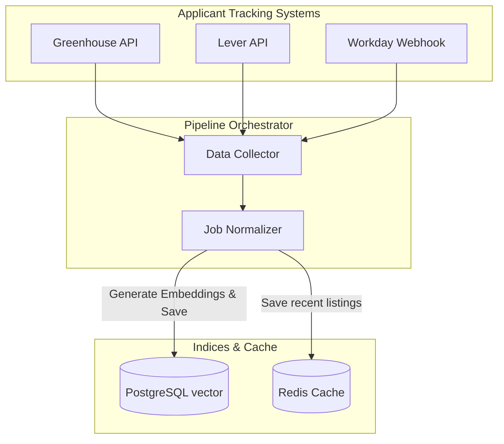

### Job Processing Pipeline
1. **Aggregators & APIs**: Pulls listings from major ATS APIs (Greenhouse, Lever, Ashby).
2. **Normalizer**: Standardizes raw JSON files into a consistent schema (job title, description, location details, salary, and requirements tags).
3. **Semantic Indexer**: Converts normalized job descriptions into high-dimensional vectors and stores them in PostgreSQL using pgvector.
4. **Ranking Engine**: Filters jobs by user preferences, runs similarity checks on resume embeddings, and ranks them by match score.
5. **Caching**: Caches recent listings and high-frequency queries in Redis with a 15-minute TTL.

---

## 6. Clean Backend Layering (FastAPI)

FastAPI endpoints use a layered, unidirectional architecture to separate concerns.

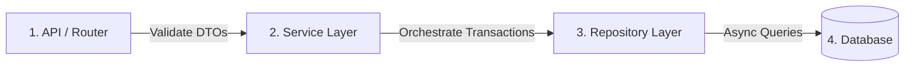

- **API Controllers (`app/api/`)**: Handlers validating DTO requests with Pydantic and formatting JSON responses.
- **Domain Services (`app/services/`)**: Implements business rules (e.g., resume tailoring logic, similarity checks). Bypasses direct database access.
- **Data Repositories (`app/repositories/`)**: Abstract class adapters implementing DB interactions, returning Pydantic entities.
- **Dependency Injection**: FastAPI `Depends` injects instances of services and database sessions, enabling easy mocking for unit tests.
- **Background Workers**: Long-running jobs (like resume parsing and vectorization) run asynchronously using FastAPI's built-in `BackgroundTasks` or Celery workers.

---

## 7. Frontend Architecture (Next.js 15 App Router)

The frontend is structured into shared core folders and domain-specific `features`.

```
frontend/
├── app/                  # Next.js layouts, loading, errors, and route directories
├── components/           # Reusable UI primitives (Button, Card, Container)
├── features/             # Domain-specific feature modules
│   ├── auth/             # Sign-in/up views, credentials validation
│   ├── resume/           # Custom CV edits, PDF views, ATS gaps panel
│   └── jobs/             # Job catalogs, search listings, matches overview
├── hooks/                # Global React hooks
├── providers/            # Application context wrappers (Theme, Toast, Query)
├── services/             # API client services
└── store/                # Zustand client stores
```

- **Global Contexts**: Enforces client theme settings and handles global Toast alerts.
- **State Management**: **Zustand** manages client-side states (e.g., active user sessions, application search history, active resume version indicators).
- **API Communication**: The global API client handles requests using standard fetch wrappers, attaching authorization headers, and managing error states.

---

## 8. API Architecture & Spec

### REST Standards
- Path structure: `/api/v1/resumes`, `/api/v1/jobs`.
- Payload wrapper: Single resources return a `data` object, catalogs return a `data` array with a `pagination` metadata block.
- Error payloads use a consistent wrapper: `{ "status": "error", "error": { "code": "...", "message": "..." } }`.

### Performance Controls
- **Rate Limiting**: Rate limits are enforced based on the user's UUID (e.g., maximum 100 requests per minute for standard users, 10 requests per minute for AI endpoints).
- **Caching**: Non-user data (such as public job directories and company catalogs) is cached using Redis.

---

## 9. Infrastructure Layout

- **Vercel**: Hosts the Next.js frontend, distributing pages through Vercel's global Edge Network.
- **Railway**: Hosts the FastAPI backend container, configured to scale dynamically based on CPU/Memory load.
- **Supabase**: Managed PostgreSQL database instance equipped with the pgvector extension and daily automated backups.
- **Supabase Storage**: Hosts resume files (`.pdf`, `.docx`) in isolated bucket folders protected by RLS rules.
- **Sentry**: Tracks runtime errors and alerts engineering teams of critical failures.

---

## 10. Security Hardening

- **JWT Signature Verification**: The backend validates JWT signatures locally using Supabase's public keys.
- **Row-Level Security (RLS)**: PostgreSQL tables enforce access boundaries by checking user IDs:
  `CREATE POLICY user_policy ON resumes FOR ALL TO authenticated USING (user_id = auth.uid());`
- **File Ingestion Rules**: Ingested resumes are restricted to PDF/DOCX formats, capped at 5MB, and validated using magic byte headers.
- **Secrets Management**: Credentials and API keys are loaded dynamically from environment files.

---

## 11. Performance Optimization

- **pgvector Indexing**: Uses HNSW indexes to keep semantic job search queries under 100ms.
- **Route Streaming**: Next.js uses `<Suspense>` boundaries to render page templates immediately, streaming AI data chunks as they become available.
- **Image Optimization**: Uses Next.js `<Image>` formats to automatically resize and compress company logo graphics.
- **Database Connection Pooling**: SQLAlchemy manages database connections using connection pooling.

---

## 12. Sequence Diagrams

### 12.1 Registration Flow
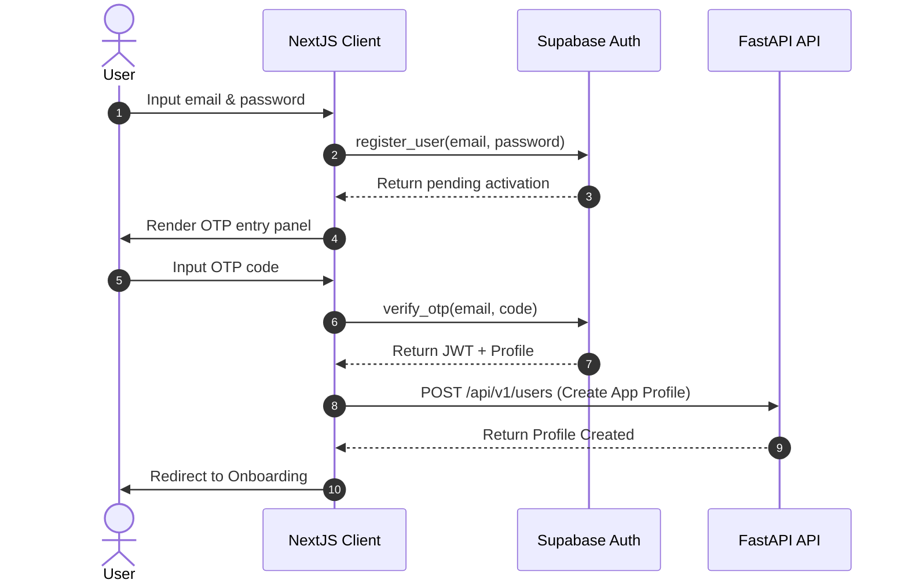

### 12.2 Login Flow
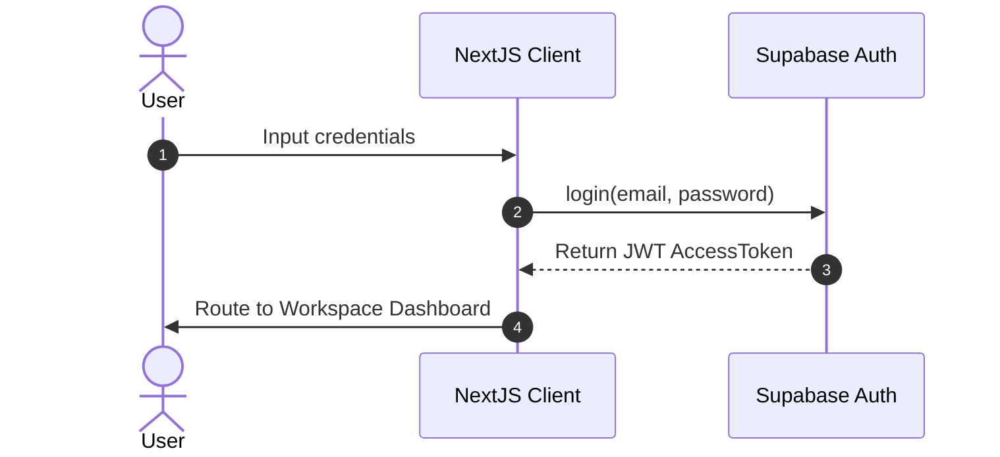

### 12.3 Resume Ingestion Flow
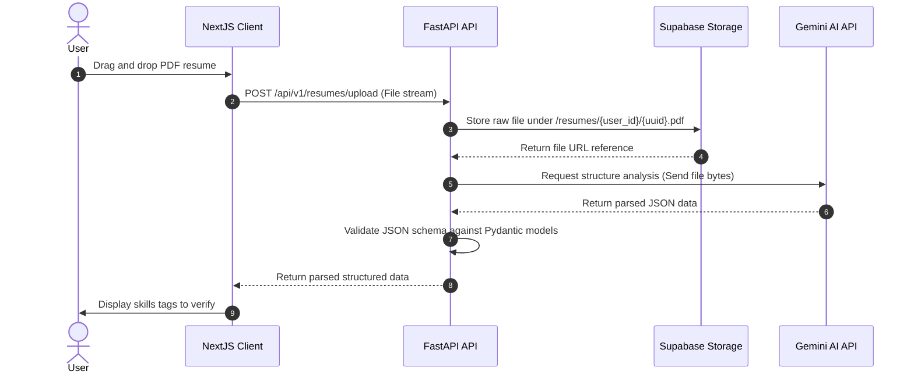

### 12.4 Job Matching Flow
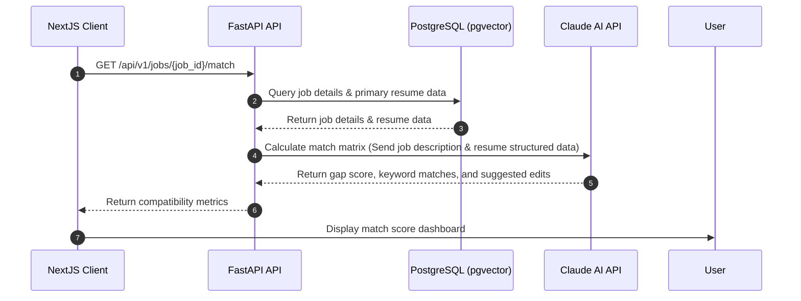

### 12.5 Resume Optimization Flow
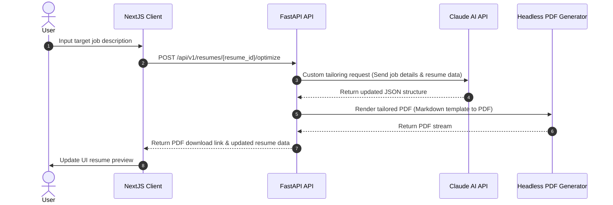

### 12.6 Application Tracking Flow
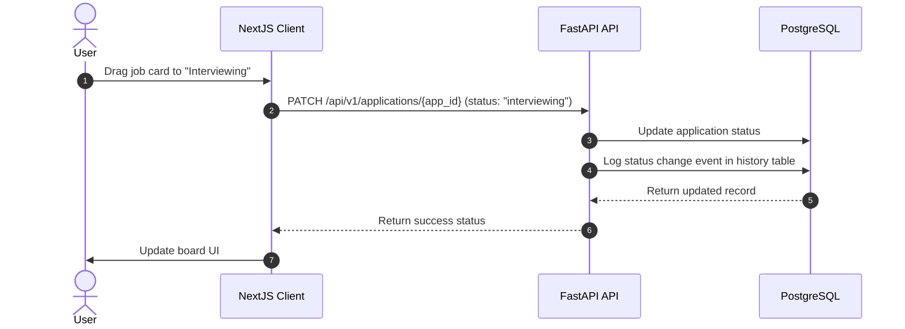

---

## 13. Entity-Relationship Diagram

```mermaid
erDiagram
    USERS {
        uuid id PK
        string email UK
        string target_role
        string experience_level
        numeric target_salary_min
        numeric target_salary_max
        timestamptz created_at
    }

    RESUMES {
        uuid id PK
        uuid user_id FK
        string version_name
        string raw_text
        jsonb structured_data
        string file_path
        integer ats_score
        boolean is_primary
        timestamptz created_at
    }

    COMPANIES {
        uuid id PK
        string name UK
        string domain
        string logo_url
        text description
        string_array industries
    }

    JOBS {
        uuid id PK
        uuid company_id FK
        string title
        text description
        string location
        numeric salary_min
        numeric salary_max
        string_array required_skills
        vector embedding
        string source_url
        timestamptz created_at
    }

    APPLICATIONS {
        uuid id PK
        uuid user_id FK
        uuid job_id FK
        uuid resume_id FK
        string status
        integer match_rate
        timestamptz applied_at
        timestamptz created_at
    }

    APPLICATION_LOGS {
        uuid id PK
        uuid application_id FK
        string event_type
        jsonb payload
        timestamptz created_at
    }

    USERS ||--o{ RESUMES : "creates"
    USERS ||--o{ APPLICATIONS : "submits"
    COMPANIES ||--o{ JOBS : "posts"
    JOBS ||--o{ APPLICATIONS : "receives"
    RESUMES ||--oN APPLICATIONS : "assigned to"
    APPLICATIONS ||--o{ APPLICATION_LOGS : "logs history"
```

---

## 14. Component Interaction Diagram

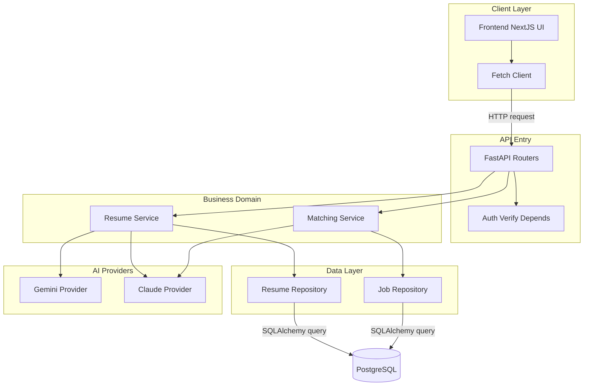

---

## 15. Deployment Topology Diagram

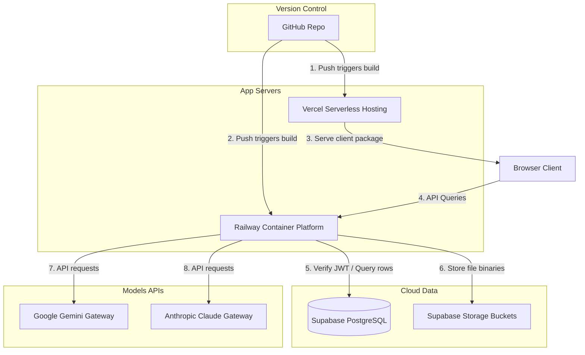
