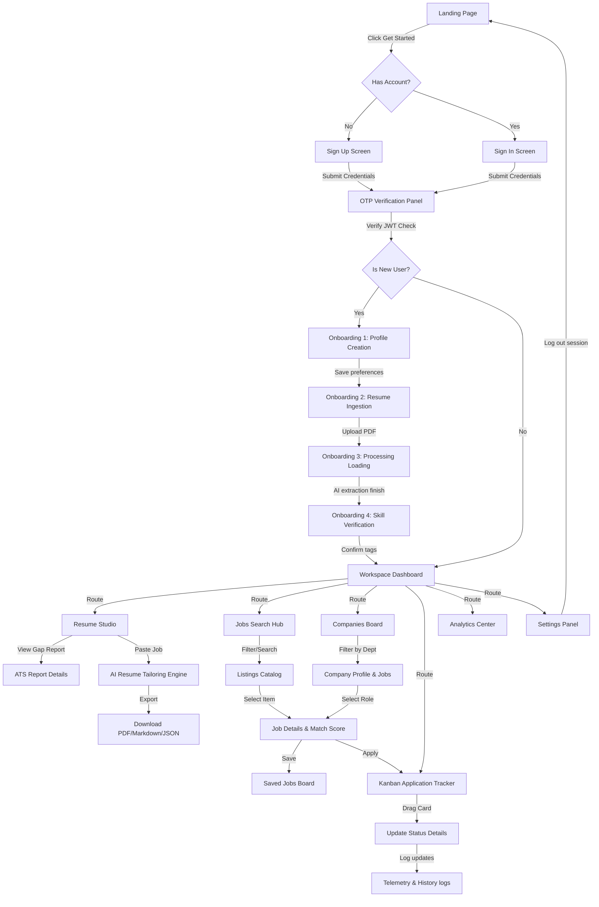

# User Flow Specification - Offerly

This document defines the complete user experience (UX) architecture, navigation flows, screen specs, state models, and journey sequences for the **Offerly** AI Career Copilot. It serves as the specifications guide for frontend routing and backend API triggers.

---

## 1. Core Visual Flow Diagrams

### Screen Hierarchy

```
[Level 0] Guest / Marketing
└── Landing Page (Marketing, Features, Roadmap)
    ├── Authentication Panel (Sign In / Sign Up)
    └── OTP Verification Panel

[Level 1] Onboarding Wizard (First-Time User Only)
└── Onboarding Step 1: Target Profile -> Step 2: Upload Resume -> Step 3: Match Verification

[Level 2] Workspace Dashboard (Main Application Hub)
├── Dashboard Grid (Applications stats, notifications, recent listings)
├── Resume Studio (PDF Preview, ATS Report, Skill Gaps, customize CV)
├── Jobs Search Hub (Listings, Filters, match score breakdown)
├── Companies Board (Corporate details, departments, jobs list)
├── Tracker Board (Kanban application tracker, status updates)
├── Analytics Center (Success charts, history tracks)
└── Settings Panel (Profile changes, theme triggers, AI API keys)
```

---

## 2. Screen-by-Screen Specifications

### Screen 01: Landing Page
- **Purpose**: Marketing presence introducing Offerly's value proposition, features list, and release timelines.
- **User Goal**: Evaluate the product capability and initiate registration.
- **Available Actions**:
  - `CLICK [GET_STARTED]`: Transitions to Screen 02 (Sign Up).
  - `CLICK [READ_DOCS]`: Navigates to local architectural Master Plan.
  - `CLICK [TOGGLE_THEME]`: Cycles between light/dark mode.
- **Next Screen**: Screen 02 (Sign Up / Authentication).
- **Previous Screen**: None (System Entry).
- **Backend Services**: Static file host.
- **Database Tables**: None.
- **AI Services**: None.

---

### Screen 02: Sign Up / Sign In Modal
- **Purpose**: Access control.
- **User Goal**: Establish new login credentials or authenticate existing session.
- **Available Actions**:
  - `SUBMIT [EMAIL + PASSWORD]`: Triggers validation, triggers OTP generation.
  - `CLICK [OAUTH_GOOGLE]` / `CLICK [OAUTH_GITHUB]`: Directs to external identity providers.
  - `CLICK [TOGGLE_MODE]`: Switches context between login and registration.
- **Next Screen**: Screen 03 (OTP Verification).
- **Previous Screen**: Screen 01 (Landing Page).
- **Backend Services**: Auth Service, Token Generation.
- **Database Tables**: `auth.users` (Internal Supabase Auth schemas).
- **AI Services**: None.

---

### Screen 03: OTP Verification Panel
- **Purpose**: Multi-Factor / Email validation safety step.
- **User Goal**: Complete security registration verifying input code.
- **Available Actions**:
  - `INPUT [6_DIGIT_CODE]`: Triggers validation check on input completion.
  - `CLICK [RESEND_CODE]`: Resets timer and sends new code.
- **Next Screen**:
  - *New User*: Screen 04 (Onboarding Wizard: Profile Creation).
  - *Returning User*: Screen 09 (Dashboard Workspace).
- **Previous Screen**: Screen 02 (Sign Up / Authentication).
- **Backend Services**: Auth Verification Service.
- **Database Tables**: `auth.users`.
- **AI Services**: None.

---

### Screen 04: Onboarding Step 1 - Profile Creation
- **Purpose**: Collect initial target role preferences.
- **User Goal**: Submit target job names, target salary range, and location configurations.
- **Available Actions**:
  - `INPUT [TARGET_ROLES]`: Auto-suggests job labels.
  - `INPUT [EXPERIENCE_LEVEL]`: Select between Entry, Mid, Senior, Lead.
  - `INPUT [SALARY_PREFERENCE]`: Numeric bounds.
  - `CLICK [CONTINUE]`: Stores profile details and advances.
- **Next Screen**: Screen 05 (Onboarding Step 2: Resume Ingestion).
- **Previous Screen**: Screen 03 (OTP Verification).
- **Backend Services**: Profiles Service.
- **Database Tables**: `users` (App profile details).
- **AI Services**: None.

---

### Screen 05: Onboarding Step 2 - Resume Ingestion
- **Purpose**: Upload document files into the user's account.
- **User Goal**: Ingest CV/Resume into Offerly.
- **Available Actions**:
  - `DROP_FILE` / `SELECT_FILE`: Uploads PDF/DOCX document (Max: 5MB).
  - `CLICK [SKIP]`: Proceeds to Dashboard with empty profile states.
- **Next Screen**: Screen 06 (Onboarding Step 3: Analysis Loading State).
- **Previous Screen**: Screen 04 (Onboarding Step 1: Profile Creation).
- **Backend Services**: Ingestion Service, Storage Bucket Client.
- **Database Tables**: `resumes` (stores file reference).
- **AI Services**: None.

---

### Screen 06: Analysis Loading State
- **Purpose**: Process document analysis asynchronously.
- **User Goal**: Wait for the AI model to finish parsing.
- **Available Actions**: None (Interactive locks active).
- **Next Screen**: Screen 07 (Onboarding Step 3: Skill Verification).
- **Previous Screen**: Screen 05 (Onboarding Step 2: Resume Ingestion).
- **Backend Services**: Parser Orchestrator.
- **Database Tables**: None (In-memory token task tracking).
- **AI Services**: **Gemini 1.5 Flash** (Parses structural elements from PDF stream).

---

### Screen 07: Onboarding Step 3 - Skill Verification
- **Purpose**: Confirm AI-parsed CV elements.
- **User Goal**: Verify that skills and experiences were extracted correctly.
- **Available Actions**:
  - `EDIT_CHIPS`: Add or delete parsed skills tags.
  - `EDIT_FIELDS`: Correct work duration dates.
  - `CLICK [VERIFY_&_COMPLETE]`: Commits details, routes user to dashboard.
- **Next Screen**: Screen 09 (Dashboard Workspace).
- **Previous Screen**: Screen 05 (Onboarding Step 2: Resume Ingestion).
- **Backend Services**: Profiles Service, Resume Management.
- **Database Tables**: `resumes` (Updates structured JSON column).
- **AI Services**: None.

---

### Screen 09: Dashboard Workspace
- **Purpose**: Central hub of the application.
- **User Goal**: Monitor application progress and match opportunities.
- **Available Actions**:
  - `CLICK [SIDEBAR_LINK]`: Route to Resumes, Jobs, Companies, or Tracker.
  - `CLICK [RECENT_JOB_CARD]`: Transitions to Screen 14 (Job Details).
  - `CLICK [NOTIFICATION_ICON]`: Toggles notification overlays.
- **Next Screen**: Screen 10 (Resume Studio), Screen 12 (Jobs Search), Screen 16 (Tracker).
- **Previous Screen**: Screen 07 (Onboarding Step 3: Skill Verification).
- **Backend Services**: Dashboard Metrics Aggregator.
- **Database Tables**: `users`, `resumes`, `applications`, `jobs`.
- **AI Services**: None.

---

### Screen 10: Resume Studio
- **Purpose**: Edit and manage CV versions.
- **User Goal**: Customize resumes for specific opportunities and download optimized versions.
- **Available Actions**:
  - `CLICK [CUSTOMIZE_FOR_JOB]`: Opens a modal to paste target job descriptions.
  - `CLICK [DOWNLOAD_PDF]`: Compiles and downloads PDF files.
  - `CLICK [VIEW_ATS_REPORT]`: Opens Screen 11 (ATS Report details).
- **Next Screen**: Screen 11 (ATS Report Details).
- **Previous Screen**: Screen 09 (Dashboard Workspace).
- **Backend Services**: Resume Customization Engine, PDF Rendering Service.
- **Database Tables**: `resumes`.
- **AI Services**: **Claude 3.5 Sonnet** (Bullet point adjustments, keyword gaps analysis).

---

### Screen 11: ATS Report Details
- **Purpose**: Identify design and structural issues in resumes.
- **User Goal**: Ensure the resume is compatible with standard recruiters ATS software.
- **Available Actions**:
  - `CLICK [APPLY_SUGGESTED_FIXES]`: Automatically adjusts typography styles or line structures.
  - `CLICK [CLOSE]`: Returns to the main Resume Studio workspace.
- **Next Screen**: Screen 10 (Resume Studio).
- **Previous Screen**: Screen 10 (Resume Studio).
- **Backend Services**: ATS Analysis Service.
- **Database Tables**: `resumes`.
- **AI Services**: **Claude 3.5 Sonnet** (ATS compliance checking, parsing check).

---

### Screen 12: Jobs Search Hub
- **Purpose**: Search and filter opportunities.
- **User Goal**: Discover opportunities and check compatibility scores.
- **Available Actions**:
  - `INPUT [SEARCH_QUERY]`: Performs semantic search over job listings.
  - `TOGGLE [FILTER]`: Filters listings by salary, location, and metadata tags.
  - `CLICK [JOB_CARD]`: Opens Screen 14 (Job Details).
  - `CLICK [SAVE_JOB]`: Saves job listing to target list.
- **Next Screen**: Screen 14 (Job Details).
- **Previous Screen**: Screen 09 (Dashboard Workspace).
- **Backend Services**: Search Service, Semantic Indexing.
- **Database Tables**: `jobs`.
- **AI Services**: **Gemini Embedding** (Generates vectors for search queries).

---

### Screen 13: Saved Jobs Board
- **Purpose**: Track bookmarked job listings.
- **User Goal**: Quick reference for opportunities before applying.
- **Available Actions**:
  - `CLICK [APPLY_NOW]`: Triggers a status change in application tracker.
  - `CLICK [DELETE]`: Removes job listing from bookmarks list.
- **Next Screen**: Screen 14 (Job Details), Screen 16 (Tracker).
- **Previous Screen**: Screen 12 (Jobs Search).
- **Backend Services**: Jobs Service.
- **Database Tables**: `jobs`, `applications` (stores state as `Bookmarked`).
- **AI Services**: None.

---

### Screen 14: Job Details & Match Score Panel
- **Purpose**: Review job specifications.
- **User Goal**: Analyze compatibility details and requirements.
- **Available Actions**:
  - `CLICK [OPTIMIZE_RESUME]`: Redirects to Resume Studio.
  - `CLICK [CREATE_APPLICATION]`: Adds card to Kanban Tracker.
  - `CLICK [COMPANY_NAME]`: Directs to Screen 15 (Company Profile).
- **Next Screen**: Screen 15 (Company Profile), Screen 16 (Tracker).
- **Previous Screen**: Screen 12 (Jobs Search).
- **Backend Services**: Matching Engine Service.
- **Database Tables**: `jobs`, `resumes`, `companies`.
- **AI Services**: **Claude 3.5 Sonnet** (Runs compatibility matrix scoring check).

---

### Screen 15: Company Profile
- **Purpose**: Review company insights.
- **User Goal**: Research corporate departments, locations, benefits, and open roles.
- **Available Actions**:
  - `SELECT [DEPARTMENT]` / `SELECT [LOCATION]`: Filters listing sub-tables.
  - `CLICK [JOB_ROW]`: Routes to Screen 14 (Job Details).
- **Next Screen**: Screen 14 (Job Details).
- **Previous Screen**: Screen 14 (Job Details).
- **Backend Services**: Companies Management.
- **Database Tables**: `companies`, `jobs`.
- **AI Services**: None.

---

### Screen 16: Kanban Application Tracker
- **Purpose**: Lifecycle tracking.
- **User Goal**: Manage job applications from discovery to offer.
- **Available Actions**:
  - `DRAG_CARD`: Changes application status.
  - `CLICK [CARD]`: Opens application details modal.
  - `CLICK [ADD_LOG]`: Adds note logs to histories.
- **Next Screen**: Screen 17 (Application Detail Panel).
- **Previous Screen**: Screen 09 (Dashboard Workspace).
- **Backend Services**: Tracker Service.
- **Database Tables**: `applications`.
- **AI Services**: None.

---

### Screen 17: Application Detail Panel
- **Purpose**: Edit application metadata.
- **User Goal**: Track interview dates, contacts, salary details, and notes.
- **Available Actions**:
  - `INPUT [INTERVIEW_DATE]`: Sets dates.
  - `CLICK [ADD_CONTACT]`: Saves contact information.
  - `CLICK [ARCHIVE]`: Hides card from active pipelines.
- **Next Screen**: Screen 16 (Tracker).
- **Previous Screen**: Screen 16 (Tracker).
- **Backend Services**: Tracker Service.
- **Database Tables**: `applications`.
- **AI Services**: None.

---

### Screen 18: Analytics Center & History
- **Purpose**: Performance metrics visualization.
- **User Goal**: Review statistics on interview rates, resume variations, and applications history.
- **Available Actions**:
  - `SELECT [DATE_RANGE]`: Refilters charts.
  - `CLICK [EXPORT_CSV]`: Downloads records data sheet.
- **Next Screen**: None.
- **Previous Screen**: Screen 09 (Dashboard).
- **Backend Services**: Telemetry Service.
- **Database Tables**: `applications`.
- **AI Services**: None.

---

### Screen 19: Settings Panel
- **Purpose**: Account management.
- **User Goal**: Set system preferences, dark mode options, and add custom AI API keys.
- **Available Actions**:
  - `INPUT [API_KEY]`: Saves user's custom Gemini/Claude keys.
  - `CLICK [TOGGLE_THEME]`: Toggles theme style.
  - `CLICK [LOGOUT]`: Ends authentication session.
- **Next Screen**: Screen 01 (Landing Page).
- **Previous Screen**: Screen 09 (Dashboard).
- **Backend Services**: Settings Service, Auth Client.
- **Database Tables**: `users`.
- **AI Services**: None.

---

## 3. UI UX States Framework

### Empty States
- **Jobs Search**: "No jobs match your filters. Try adjusting salary ranges or adding more skills."
- **Resume Studio**: "No resumes uploaded yet. Drag and drop your CV here to start tailoring."
- **Kanban Tracker**: "No applications tracked yet. Bookmark a job or click [Create Application] to start."
- **Action Pattern**: Every empty state must display a primary helper button (e.g., "Upload Resume" or "Reset Filters") to guide the user to the next step.

### Loading States
- **Global Page Load**: A sharp, high-contrast spinner paired with a monochrome skeleton layout.
- **AI Analysis**: Display a circular progress indicator with a pulsing step log (e.g., `PARSING_SECTIONS...`, `ANALYZING_KEYWORDS...`).
- **Lists / Tables**: Render sharp-edged rectangular block skeletons with no animation.

### Success States
- **Form Submissions**: A green banner check symbol with a clear message: `UPDATE_SUCCESSFUL`.
- **Match Calculations**: Display the match percentage badge in a Nothing Red outer highlight.
- **Resume Tailored**: A success card with format choices (PDF, Markdown, JSON) and an action button to copy the download link.

### Error States
- **Validation Failures**: Outline invalid input boxes in red (`var(--destructive)`), displaying a monospace description under the field: `ERROR: INVALID_FORMAT`.
- **System Failure**: Display a warning card with the error code (e.g., `RESOURCE_UNAVAILABLE`) and a retry button.

---

## 4. Key Security & Verification Flows

### Authentication Flow
```
[User Login Input]
        │
        ▼
[Validate locally (Zod schemas)] ──(Fail)──> [Render validation warnings]
        │
        ▼ (Pass)
[Post to Supabase API] ──(Fail)──> [Render credential error]
        │
        ▼ (Pass)
[Receive JWT Session Token]
        │
        ▼
[Store JWT securely in Client Store]
        │
        ▼
[Embed JWT in Authorization headers]
```

### Permission Flow
- **Data Boundary Check**: All API queries check the user's validated UUID before fetching database rows.
- **Supabase Storage Access**: Restricts resume upload bucket directories (`/resumes/{user_id}/*`) using Row-Level Security policies.
- **API Key Fallback**: The backend defaults to system API keys if the user's custom keys are missing.

### Decision Trees (AI Provider Selection)
```
          [Request: AI Process]
                    │
                    ▼
          {Operation Type Check}
          /                    \
  (Ingest CV / parse PDF)    (ATS Gaps / Tailor Bullet points)
        /                        \
       ▼                          ▼
[Google Gemini 1.5 Flash]     [Anthropic Claude 3.5 Sonnet]
(Low Latency, High Context)   (Logical Reasoning, Keyword Math)
```

---

## 5. User Journeys

### Journey A: First-Time User
1. **Discover**: Ingests marketing details on the **Landing Page**.
2. **Authenticate**: Registers using an email and password, then enters the verification code on the **OTP Panel**.
3. **Configure**: Fills out target roles and salary preferences in **Onboarding Step 1**.
4. **Ingest**: Drags and drops a PDF resume in **Onboarding Step 2**.
5. **Wait**: Watches the step-by-step progress list on the **Analysis Screen**.
6. **Verify**: Reviews parsed skills tags on the **Skills Verification Screen**.
7. **Land**: Redirected to the **Workspace Dashboard** with initial matches preloaded.

### Journey B: Returning User
1. **Enter**: Lands on the page. The system detects an active JWT token and bypasses login screens.
2. **Resume**: User goes straight to the **Workspace Dashboard**.
3. **Monitor**: Reviews interview notifications and bookmarks list.
4. **Action**: Selects an active job, optimizes their resume for it, and updates their tracking board.

### Journey C: Guest User
1. **Enter**: Arrives at the **Landing Page**.
2. **Review**: Explores the system architecture diagram and release roadmaps.
3. **Limit**: Clicks "Get Started". Since guest access is restricted to protect API resources, the user is redirected to the authentication modal to sign up.

### Journey D: Resume Update & Customization
1. **Trigger**: User opens **Resume Studio** and clicks "Customize for Job".
2. **Input**: Pastes the job description from the target role.
3. **Analyze**: The backend runs a keyword-gap analysis, comparing CV sections with job requirements.
4. **Review**: The user views missing skills and clicks "Generate Tailored Bullet Points".
5. **Preview**: The user reviews the updated bullet points in the layout editor.
6. **Export**: Downloads the optimized CV as a PDF file.

### Journey E: Application Tracking Progression
1. **Discover**: User finds a matching opportunity on the **Jobs Board**.
2. **Bookmark**: Clicks "Save Job", adding it to their bookmarks list.
3. **Apply**: Sends their resume and moves the job card to the **Applied** column on the Kanban tracker.
4. **Schedule**: Receives an interview invite, opens the card details, and adds the interview date and recruiter contact info.
5. **Outcome**: Receives an offer, updates the card status to **Offer Received**, and logs the salary details in the history tab.

---

## 6. Complete System Flowchart


