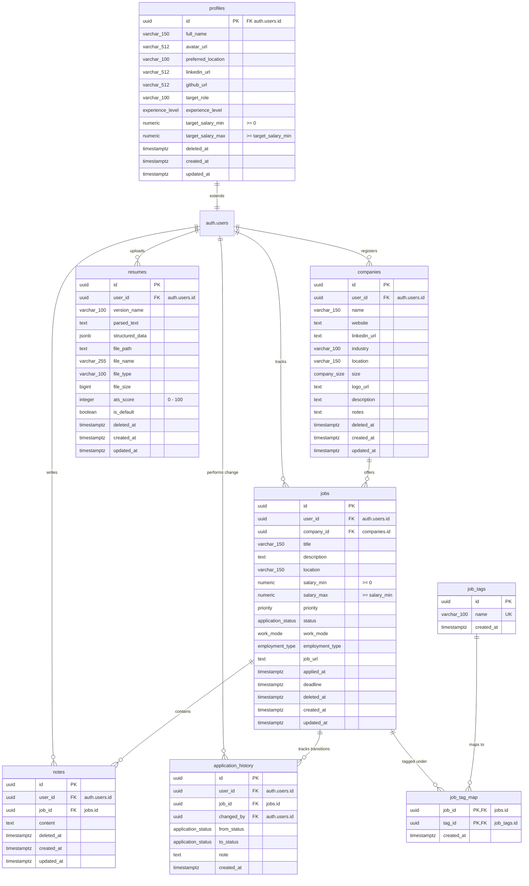

# Entity-Relationship Diagram (ERD) - Offerly

This document visualizes the complete database schema layout for the Offerly platform as of Sprint 2.

---

## Mermaid Diagram

```mermaid
erDiagram
    profiles {
        uuid id PK "FK auth.users.id"
        varchar_150 full_name
        varchar_512 avatar_url
        varchar_100 preferred_location
        varchar_512 linkedin_url
        varchar_512 github_url
        varchar_100 target_role
        experience_level experience_level
        numeric target_salary_min ">= 0"
        numeric target_salary_max ">= target_salary_min"
        timestamptz deleted_at
        timestamptz created_at
        timestamptz updated_at
    }

    companies {
        uuid id PK
        uuid user_id FK "auth.users.id"
        varchar_150 name
        text website
        text linkedin_url
        varchar_100 industry
        varchar_150 location
        company_size size
        text logo_url
        text description
        text notes
        timestamptz deleted_at
        timestamptz created_at
        timestamptz updated_at
    }

    jobs {
        uuid id PK
        uuid user_id FK "auth.users.id"
        uuid company_id FK "companies.id"
        varchar_150 title
        text description
        varchar_150 location
        numeric salary_min ">= 0"
        numeric salary_max ">= salary_min"
        priority priority
        application_status status
        work_mode work_mode
        employment_type employment_type
        text job_url
        timestamptz applied_at
        timestamptz deadline
        timestamptz deleted_at
        timestamptz created_at
        timestamptz updated_at
    }

    resumes {
        uuid id PK
        uuid user_id FK "auth.users.id"
        varchar_100 version_name
        text parsed_text
        jsonb structured_data
        text file_path
        varchar_255 file_name
        varchar_100 file_type
        bigint file_size
        integer ats_score "0 - 100"
        boolean is_default
        timestamptz deleted_at
        timestamptz created_at
        timestamptz updated_at
    }

    notes {
        uuid id PK
        uuid user_id FK "auth.users.id"
        uuid job_id FK "jobs.id"
        text content
        timestamptz deleted_at
        timestamptz created_at
        timestamptz updated_at
    }

    application_history {
        uuid id PK
        uuid user_id FK "auth.users.id"
        uuid job_id FK "jobs.id"
        uuid changed_by FK "auth.users.id"
        application_status from_status
        application_status to_status
        text note
        timestamptz created_at
    }

    job_tags {
        uuid id PK
        varchar_100 name UK
        timestamptz created_at
    }

    job_tag_map {
        uuid job_id PK, FK "jobs.id"
        uuid tag_id PK, FK "job_tags.id"
        timestamptz created_at
    }

    profiles ||--|| "auth.users" : "extends"
    "auth.users" ||--o{ companies : "registers"
    "auth.users" ||--o{ jobs : "tracks"
    "auth.users" ||--o{ resumes : "uploads"
    "auth.users" ||--o{ notes : "writes"
    "auth.users" ||--o{ application_history : "performs change"
    
    companies ||--o{ jobs : "offers"
    jobs ||--o{ notes : "contains"
    jobs ||--o{ application_history : "tracks transitions"
    jobs ||--o{ job_tag_map : "tagged under"
    job_tags ||--o{ job_tag_map : "maps to"
```
